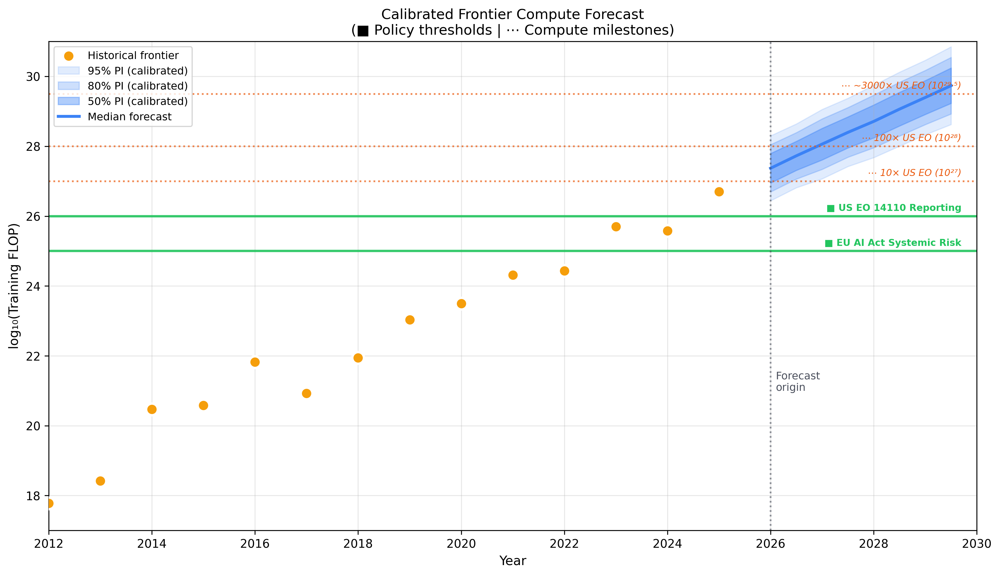
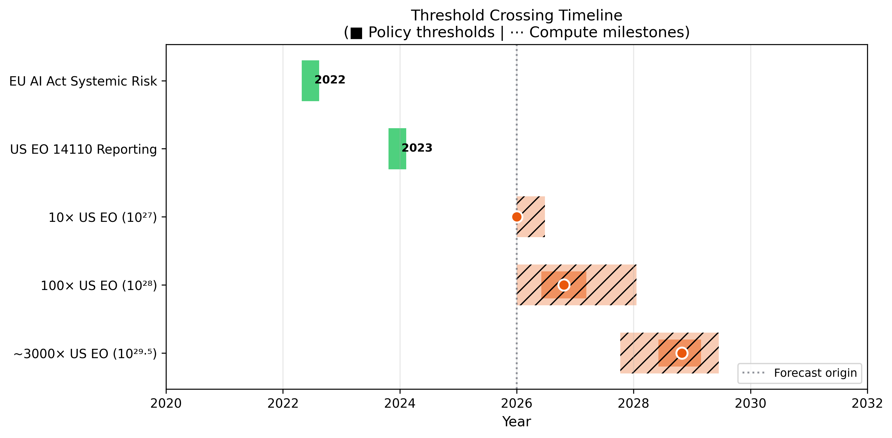
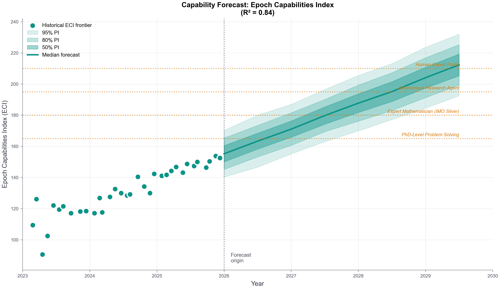
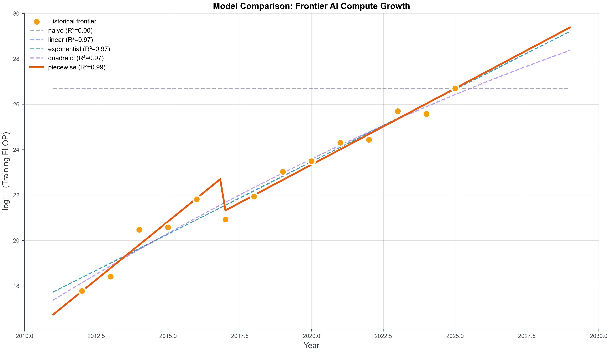
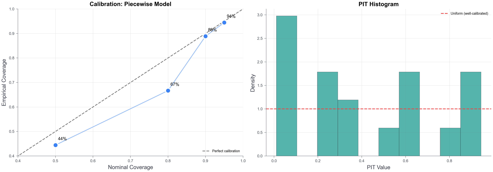
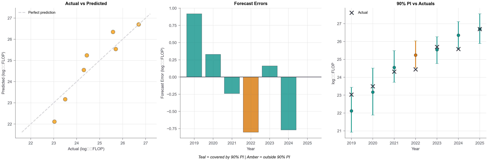
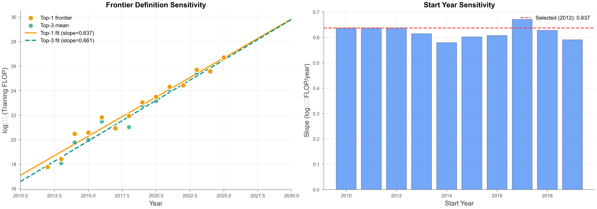
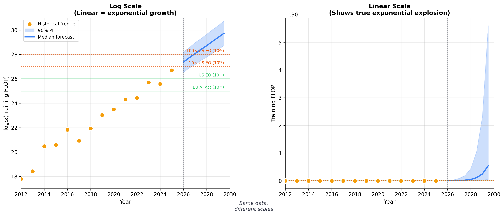

|  Red Lines Forecasting: When Will Frontier AI Cross Compute Thresholds?[^1]  |
| ----- |
| **Author:** Kwesi Amanfu 
**Affiliation:** Independent 
**With:** Apart Research  

**Abstract**  
We forecast when frontier AI training runs will cross compute thresholds relevant to AI governance. Frontier models are those trained with the largest computational budgets each year; we measure training compute in FLOP (floating-point operations—the total computational work used to train a model). Using Epoch AI data, we find both policy-defined thresholds (EU AI Act 10²⁵ FLOP, US EO 10²⁶ FLOP) have already been crossed. Compute milestones at 10×, 100×, and ~3000× the US EO threshold are expected within 1–3 years. We validate forecasts with rolling-origin cross-validation and calibration correction. Critically, we distinguish policy thresholds from compute milestones—the latter are training budget forecasts, not capability claims. |

## **1. Main Results**

### What we're forecasting

AI governance uses compute thresholds to trigger regulatory requirements. The EU AI Act flags models trained above 10²⁵ FLOP, triggering systemic risk assessment requirements. US Executive Order 14110 (now rescinded) previously required reporting above 10²⁶ FLOP—we retain this as a reference threshold given its influence on AI governance discourse. We forecast when frontier training runs will cross these thresholds—and milestones beyond them.

The Epoch Capabilities Index (ECI) aggregates performance across major AI benchmarks into a single score. Epoch defines 165 ECI as roughly "PhD-level problem solving"—the ability to solve novel research-level problems. We use ECI to cross-validate our compute forecasts with capability trends.

### The key finding

*Figure 1 – Frontier AI compute forecast (2012–2029). Gold dots: historical frontier models. Blue shaded regions: 50%, 80%, 95% prediction intervals. Solid lines: policy-defined thresholds (EU AI Act, US EO). Dotted lines: compute milestones (10×, 100×, ~3000× US EO).*

**Both policy thresholds have already been crossed.** The EU AI Act threshold (~10²⁵ FLOP) was crossed around 2022. The US EO threshold (~10²⁶ FLOP) was crossed around 2024.

### When will we hit future milestones?

*Figure 2 – Timeline of threshold crossings. Green: already crossed. Orange/hatched: future estimates with 50% and 95% confidence intervals.*

| Threshold | Value | Estimated Crossing | Status |
|-----------|-------|-------------------|--------|
| EU AI Act | 10²⁵ FLOP | ~2022 | ✓ Crossed |
| US EO 14110 | 10²⁶ FLOP | ~2024 | ✓ Crossed |
| 10× US EO | 10²⁷ FLOP | 2026 | Imminent |
| 100× US EO | 10²⁸ FLOP | 2027 | ~1 year |
| ~3000× US EO | 10²⁹·⁵ FLOP | 2028–2029 | ~2.5 years |

### Capability forecasting agrees

*Figure 6 – Capability forecast using Epoch Capabilities Index (ECI). Current frontier: ~154 ECI. Growth: ~16 points/year.*

The ECI capability forecast predicts PhD-level problem solving (~165 ECI) by late 2026—roughly aligning with the 10× US EO compute milestone.

---

## **2. Why This Matters**

Policymakers set thresholds but lack tools to forecast *when* they'll be crossed. Our analysis shows:
- **Both existing policy thresholds are already crossed** — governance mechanisms should already be active
- **Future milestones arrive quickly** — 10× US EO in 2026, 100× in 2027
- **Uncertainty grows rapidly** — 95% CI spans 2+ years for milestones beyond 2027

**Important distinction:** Policy thresholds (EU AI Act, US EO) trigger actual regulations—risk assessments, reporting requirements. Compute milestones (10×, 100×, ~3000× US EO) are forecasting markers we define for visualization; they carry no regulatory weight and are not capability claims.

---

## **3. Important Caveats**

### Compute ≠ Capability

We forecast **when training budgets will grow**, not when capabilities will emerge. As Erben et al. (2025) show: *"Compute only weakly correlates with aggregated task performance."* The compute milestones (10×, 100×, ~3000× US EO) are training budget markers, not capability claims.

### Why not "ASL-4 = 10²⁷ FLOP"?

ASL-4 (AI Safety Level 4) is a capability tier from Anthropic's Responsible Scaling Policy, designed to trigger safety measures when models can autonomously conduct novel research. Crucially, Anthropic defines ASL levels via capability evaluations, not FLOP. There is no "ASL-4 = X FLOP" in the literature. We avoid this common error by using policy-anchored milestones instead.

### No saturation modeling

There's growing discussion of "hitting a wall"—meaning frontier labs may face data exhaustion (running out of high-quality training data), diminishing algorithmic returns (each doubling of compute yields smaller capability gains), or hardware limits (chip manufacturing and energy constraints). Our exponential models cannot capture S-curve saturation. Historical data (2012–2025) shows no clear slowdown, but if frontier labs are already seeing diminished returns, our forecasts would be optimistic.

---

## **4. Methods**

### Data

| Source | Coverage | What we use |
|--------|----------|-------------|
| Epoch AI Notable Models | 2012–2025 | Annual frontier compute |
| Epoch Capabilities Index | 2023–2025 | Monthly frontier capability |

### Threshold Taxonomy

**Policy-Defined (solid lines):** EU AI Act (10²⁵), US EO 14110 (10²⁶, now rescinded) — explicit in regulatory text

**Compute Milestones (dotted lines):** 10×, 100×, ~3000× US EO — our forecasting markers, not capability claims

### Forecasting Approach

We forecast in log₁₀(FLOP) space—meaning we model 10²⁵, 10²⁶, 10²⁷ rather than the raw numbers (which span many orders of magnitude). In this space, a "linear" trend corresponds to exponential growth in raw FLOP (~4.5×/year). We compared 5 models (naive, linear, piecewise, quadratic, exponential) and selected piecewise for best fit—more complex models don't improve short-horizon forecasts.

**Validation:**
- Rolling-origin cross-validation (1, 2, 3 years ahead)
- Calibration correction to achieve ~90% prediction interval coverage
- Bootstrap resampling (2,000 iterations) for uncertainty

---

## **5. Validation**

### Model Comparison

*Figure 3 – Five models compared. Linear selected for interpretability; ΔBIC < 2 vs. more complex models.*

### Calibration

*Figure 4 – Left: Empirical vs. nominal coverage. Right: PIT histogram (uniform = well-calibrated).*

### Backtest

*Figure 5 – Rolling-origin backtest. Teal = actual within 90% PI; amber = outside.*

### Robustness

*Figure 7 – Sensitivity to frontier definition (top-1 vs top-3) and start year.*

---

## **6. Limitations**

1. **Compute ≠ capability.** FLOP is an imperfect proxy. Algorithmic improvements matter.

2. **Threshold uncertainty.** Beyond EU AI Act and US EO, our milestones are forecasting markers—not literature-backed claims.

3. **No saturation.** If "hitting a wall" is real, our forecasts are optimistic. Models can't capture S-curves.

4. **Short horizon.** Uncertainty grows rapidly; 95% CI spans 2+ years beyond 2027.

---

## **7. Conclusion**

Both policy-defined thresholds (EU AI Act 10²⁵, US EO 10²⁶) have been crossed. Compute milestones at 10×, 100×, and ~3000× the US EO threshold are expected within 1–3 years under current trends.

These are training budget forecasts, not capability predictions. Governance mechanisms triggered at these compute levels should incorporate capability evaluations, not rely on FLOP alone.

---

---

## **Supplementary Figure**

*Figure S1 – Log scale vs. linear scale. Left: the log₁₀ view we use for modeling (linear trend = exponential growth). Right: raw FLOP showing the true exponential explosion—all historical data and policy thresholds appear near zero relative to 2030 forecasts.*

---

## **Code and Data**

- **Code**: `redline_forecast_submission.ipynb`
- **Data**: Epoch AI Notable Models, Epoch AI Benchmarking Hub (both CC-BY)
- **Outputs**: `output/` directory

## **References**

1. Epoch AI. (2025). *Notable AI Models Database*. https://epoch.ai/data/notable-ai-models

2. Epoch AI. (2025). *AI Benchmarking Hub & Epoch Capabilities Index*. https://epoch.ai/benchmarks

3. Erben, A., Negele, M., Heim, L., Sevilla, J., Fernandez Llorca, D., & Gomez, E. (2025). *Training Compute Thresholds - Key Considerations for the EU AI Act*. JRC Publications Repository. https://publications.jrc.ec.europa.eu/repository/handle/JRC143255

4. European Union. (2024). *AI Act, Article 51*. Official Journal of the European Union.

5. Executive Office of the President. (2023). *Executive Order 14110*. Federal Register. (Rescinded January 20, 2025 by EO 14148.)

6. Sevilla, J., et al. (2022). *Compute Trends Across Three Eras of Machine Learning*. arXiv:2202.05924.

7. Anthropic. (2023). *Anthropic's Responsible Scaling Policy*. (Defines ASL via capability evals, not compute.)

## **LLM Usage Statement**

Claude assisted with code development and OpenAI Prism was used in drafting. All results verified manually.

---

[^1]: Research conducted at the [Technical AI Governance Challenge](https://apartresearch.com/sprints/the-technical-ai-governance-challenge-2026-01-30-to-2026-02-01), 2026
